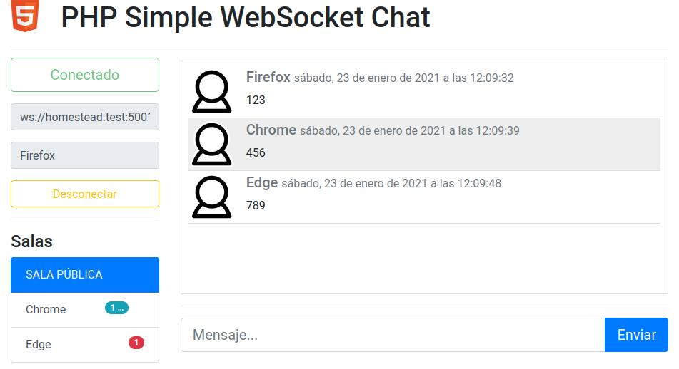

# PHP Simple WebSocket Chat

Usa la librería https://github.com/ghedipunk/PHP-Websockets

## Servidor

* Mover a la carpeta servidor `cd servidor`
* Opcional: editar parámetros en `chat.php`
* Ejecutar servidor `./chat.php` o `php chat.php`

## Cliente
* Abrir cliente/index.html
* Modificar parámetros de servidor y nombre de usuario
* Conectar

---

### Vagrant Homestead

* Servidor: `$echo = new chat_server("192.168.10.10","5001");`
* En máquina host `myVirtualHost.test/php-simple-websocket-chat/cliente/index.html`

#### Túnel SSH para transmitir por red local
* Maquina host: `ssh -L (local host ip):5001:192.168.10.10:5001 vagrant@homestead.test`
* Máquina en red: `http://(local host ip):8000/php-simple-websocket-chat/cliente/index.html`
